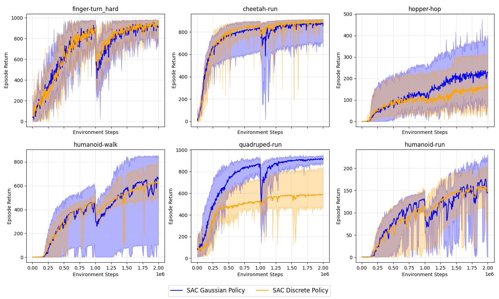

# SAC (Soft Actor-Critic)
The repository contains the PyTorch implementation of the Soft Actor-Critic (SAC) described in ["Soft Actor-Critic: Off-Policy Maximum Entropy Deep Reinforcement Learning with a Stochastic Actor"](https://arxiv.org/pdf/1801.01290).

This implementation of the Soft Actor-Critic algorithm has been updated to support modern libraries and environments. It is compatible with Gymnasium and works with the DeepMind Control Suite.

## Resuts and Comparison
SAC was benchmarked on six environments from the DeepMind Control Suite. We evaluated a Gaussian policy against a discrete policy across 10 random seeds, reporting results with 95th percentile confidence intervals. The same set of hyperparameters was used across all tasks.

## Requirements
Library  | Version
:-------------------------:|:-------------------------:
pytorch |  2.8.0
gymnasium | 1.2.0
mujoco | 3.3.5
dm_control | 1.0.31
numpy | 2.3.2
wheel | 0.45.1

